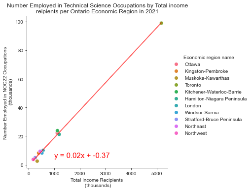

# Table of Contents
* [Overview](#overview)
* [Assessment of Economic Factors](#assessment-of-economic-factors)
* [Assessment of Health Factors](#assessment-of-health-factors)
* [Assessment of International Connection](#assessment-of-international-connection)
* [Conclusion](#overall-conclusion)

# Overview
## Purpose
This study aims to discover the "best" places to live in Ontario. There is inherent bias and subjectivity present in this topic, so many indicators have been used that are typically and conventionally associated with quality of life. The study is structured on a per-indicator basis, with isolated insights feeding into a broader recommendation.
## Scope
This study is limited to Ontario, and uses recent datasets. The findings presented are all at a single point in time; trend analysis has been deemed out of scope for this initial inquiry.
## Data Sources
**@Group - I've put what I've used below; please append!**
Data sources used are as follows:
* [Canadian Census of Population (2021)](https://www12.statcan.gc.ca/census-recensement/2021/dp-pd/prof/details/download-telecharger.cfm?Lang=E), sourced through Statistics Canada
* [Economic Wage Data by Job (2021)](https://open.canada.ca/data/en/dataset/adad580f-76b0-4502-bd05-20c125de9116), sourced through Employment and Social Development Canada and organized with the National Occupation Classification (2021) system
* [Canadian Labour Force Survey (2021)](https://www150.statcan.gc.ca/t1/tbl1/en/cv.action?pid=1410038901), sourced through Statistics Canada
* [Ontario Data Catalogue (2021)](https://data.ontario.ca/), sourced through Ontario Data Canada
https://www.flyontario.com/air-service/statistics 
https://www150.statcan.gc.ca/t1/tbl1/en/tv.action?pid=2310025301
https://en.wikipedia.org/wiki/List_of_airports_in_Ontario
https://geohub.lio.gov.on.ca/datasets/lio::ministry-of-health-service-provider-locations/explore?location=50.581579%2C-84.745000%2C4.78
https://www.ontario.ca/page/paying-long-term-care
https://www.advantageontario.ca/AAO/Content/Resources/Consumers/About_Long_Term_Care
https://www.canada.ca/en/health-canada/services/home-continuing-care/long-term-facilities-based-care.html

## Limitations and Other Remarks
* Data sourced from Statistics Canada are frequently pre-aggregated and not offered at a record level, so error calculations are either done on a "best effort" or are unavailable.
* Data sourced from Statistics Canada can sometimes arrive in pre-determined bins (e.g., histogram) for which outliers are by default unavailable and cannot be calculated.
* Data used represents a snapshot in time (e.g., 2021 for much of the economic data), on which trend analysis cannot be performed. This means that COVID-related and other global factors (work from home, the "Great Resignation," economic volatility) may skew any given year of information, something that could be normalized over a longer period.

# Assessment of Economic Factors
## Inquiry
We wished to study which region of Ontario was "best" when it came to economic factors. As such an area of inquiry is immesurably broad, given time constraints we proxied it with the following: which economic region within Ontario has the most job opportunities, the highest wages, and the best cost of living?

## Wages and Employment Opportunities

* There is no significant difference between the average median, maximum, or minimum wage of individual tech jobs related to natural and applied sciences in different economic regions in Ontario
    * p-values are 0.63 between the average of the minimum wages, 0.48 between the average of the maximum wages, and 0.55 between the average of the median wages 
* The absolute maximum wage possible for this jobset in Ontario is the highest in three economic regions
    * The max wage in Toronto, Kitchener-Waterloo-Barrie, and Hamilton-Niagara Peninsula is $96 per hour, while the next highest wage is $72 per hour in Stratford-Bruce Peninsula
    * This could indicate that the Toronto, Kitchener-Waterloo-Barrie, and Hamilton-Niagara Peninsula economic regions have the best job progression prospects
        * The max wages are likely earned by more senior employees, and the max wage is the highest in these three areas while the median and minimum wages are similar to those in all other economic regions, so wages appear to increase more in these areas than in the remaining economic regions
* The absolute minimum wage possible for this jobset in Ontario is very similar among all economic regions
* **The minimum and median wage for technical occupations related to natural and applied sciences is the same for all economic regions, so the best place to work at low seniority is one where the cost of living is low. Once seniority and experience is gained, the highest wages are available in the Toronto, Kitchener-Waterloo-Barrie, and Hamilton-Niagara Peninsula economic regions in Ontario.**
---

* The number employed in the specified ocupations (NOC 22) per economic region correlates very strongly with the total number employed per economic region
    * R-value is 0.998, indicating a very strong correlation
    * This indicates that job opportunities in this sector per capita are very similar in each economic region
* The total employed population in Toronto is, however, much larger than in other economic regions and so is the number employed in technical scientific occupations
* **Overall, while there appears to be very little difference in job opportunities with regards to percentage of total population, there is a much higher number of opportunities in the most populated economic region - Toronto (which has >98 thousand employed in these occupations), which ostensibly comes with a much higher amount of competition for employment**
    * The next most populated economic regions, Ottawa, Kitchener, and Hamilton, have the next most opportunities, with 21-23 thousand employees in these occupations

## Commute Time and Spend on Housing

* The differences in the average percent of commuters with each commute time differs significantly between economic regions
    * The p-value for the percent commuting under 15 min by economic region in Ontario is 1.2e-39
    * The p-value for the percent commuting 15-29 min by economic region in Ontario is 5.5e-10
    * The p-value for the percent commuting 30-44 min by economic region in Ontario is 0.00048
    * The p-value for the percent commuting 45-59 min by economic region in Ontario is 0.00018
    * The p-value for the percent commuting over 60 min by economic region in Ontario is 1.3e-09
    * **Each p-value is well under 0.01, which indicates that there are significant differences among each group**
* The economic divisions with the shortest commute times are:
    * Northwest, with 67% of commuters that commute for <15 min
    * Northeast, with 45% of commuters that commute for <15 min
    * Stratford-Bruce Peninsula, with 42% of commuters that commute for <15 min
* The economic divisions with the longest commute times are: 
    * Kitchener-Waterloo-Barrie, with 13% of commuters that commute for >60 min
    * Toronto, with 12% of commuters that commute for >60 min
    * Muskoka-Kawarthas, with 11% of commuters that commute for >60 min
* **Overall there are significant differences in commute times by econoimc region. The best economic region to live in based only on commute is Northwest, while the worst is Kitchener-Waterloo-Barrie. This should be taken into account when choosing where to live, but is likely a secondary consideration to the number of available jobs in a location**
---

* The differences in average percentage of households spending >30% of their income on shelter per economic region are significant
    * The p-value is 2.7e-35, which is well under any reasonable cutoff to reject the null hypothesis that there is no significant difference in these values
* The economic divisions with the highest cost of living are:
    * Toronto, with on average 48% of households spending >30% of their income on housing
    * Kitchener-Waterloo-Barrie, with on average 37% of households spending >30% of their income on housing
    * Hamilton-Niagara Peninsula, with on average 36% of households spending >30% of their income on housing
* The economic divisions with the lowest cost of living are: 
    * Northwest, with on average 17% of households spending >30% of their income on housing
    * Windsor-Sarnia, with on average 24% of households spending >30% of their income on housing
    * Northeast, with on average 25% of households spending >30% of their income on housing
* **Overall there are significant differences in cost of living as proxied by average percent of households spending >30% of their income on shelter by econoimc region. The best economic region to live in based only on cost of living is Northwest, while the worst is Toronto. This should be taken into account when choosing where to live, but is likely a secondary consideration to the number of available jobs in a location**

# Assessment of Health Factors
## Inquiry :Which areas/cities are the best in ontario based on health and safety
## Physician Count
*Visualization indicates Northwest region is better to live in terms of health care as the Physician population ratio is 4.0:1000higher than ideal ratio 1:1000.
*However, Hamilton-Niagara Peninsula and Windsor-Sarnia need attention to higher more physician as their ratio is 0.9:1000lower than ideal ration 1:1000.
*Best Economic region in terms of  physicians availability are Northwest and Muskoka-Kawarthas.
## Violation per census sub division
*There is a positive linear relationship between a city’s population and Number of violation.the r-squared is: 0.9
*Highly populated areas are not safe to live compared to less populated area.
*High risk city is Toronto with 84360 reported violations.
*Low risk city is Guelph with 1570 reported violations.
* Death Registered by Cities / Towns
   * Toronto had the highest deaths registered in a population of 5.6m while Marathon had the lowest deaths registered in a population of 3,000.
   * Cities with greater population had greater deaths registered.
   * While there can be many factors for cause of death, high populated areas also had the highest cases of death from Covid-19, (Source https://www.publichealthontario.ca/) as well as highest fatal vehicle collisions. (Source Open Data- Toronto Police Service (tps.ca))
   * Overall, there was a positive linear relationship between a city's population and registered deaths.

* Number of health impacts by Cities / Towns due to oil spills
   * 43 Oil Spills occurred just in Toronto out of 327 occurrences (13%) 
   * Occurrences of oil spills are more likely to occur in bigger land areas with greater population.

* Social Assistance Programs offered by Cities / Towns
   * St. CAtharines had the highest % of Social Assistance Programs offered compared to its population (26%)
   * Toronto had the lowest % of Social Assistance Programs offered compared to its population (8%)
   * While St. Catharines had the highest % of Social Assistance Programs Offered to its population, the % of social assistance programs offered to a city’s population has a weak  linear relationship.

# Assessment of International Connection
## Inquiry
## AAnalysis for Airports in Ontario, Retirement Homes & Long-Term Care homes
-	Why is this data needed 
Because we are looking at which city is the best to live in, we want to take number of airports into account. According to Stats Canada, in the year 2021, the Air passenger traffic at Toronto/Lester B Pearson International airport saw at least 12,368,926 total passengers who enplaned and deplaned. 
Limitations 
-	In looking for data sets for airports in Ontario, there were a few limitations.
1.	Ontario GeoHub provides a vast summary of official airports in Canada. And by their definition, ‘Airports’ includes Hospital Heliport, Airport, Seaplane Base and Heliport. Therefore, providing a range of different airport types in each city. 
2.	In getting dataset from Ontario GeoHub, the data was created in 2012 but last updated in 2022. With this dataset, there were a few errors specifically with the latitude and longitude. When plotting the latitude and longitude from Ontario GeoHub, the map showed Russia and China. With this, it made the data incorrect
Analysis
 
From this map, majority of the airports are in southern Ontario (Toronto, Ottawa, Hamilton, Kitchener–Cambridge–Waterloo, London, St. Catharines–Niagara, Windsor, Oshawa, Barrie, Kingston, Guelph, Brantford, Peterborough).

Analysis of the number of Retirement homes in Ontario

Why is this data needed? 
-	Retirement homes primarily serve individuals who seek a degree of independence yet require additional assistance with their day-to-day activities and lives. Regulated by the Retirement Homes Regulatory Authority, the RHRA Authority oversees retirement homes that cater to seniors who prioritize independence but require supplementary support for their daily tasks and lifestyles. These homes must offer a minimum of two services out of the thirteen listed in the Retirement Homes Act, which includes providing meals, assistance with bathing, providing a dementia care program, administering medicine, providing incontinence care, or making available the services of a doctor, nurse, or pharmacist. 

Limitations
-	Majority of the data set provided did not break down how much retirement homes cost per city as each city is different based on different factors. 
-	In obtaining different data, majority of the data found were more than 4 years old limiting the number of valuable information. 

Analysis
-	In generating the results from the data, the first step was to sort the values in ascending order. This would help generate a result of the first 10 cities in Ontario. In plotting the data, it was evident that the top 10 cities were in Southern Ontario (Ottawa - 80, Toronto - 76, Hamilton - 33, Mississauga – 23, London – 20, Kitchener - 15, Barrie - 12, Windsor - 12, Oakville - 12, Burlington - 11)

Analysis of the number of Long-Term Care in Ontario

Why is this data needed? 
-	As defined by Health Canada, Long-Term Care (LTC) provides living accommodation for people who require on-site delivery of 24-hour, 7 days a week supervised care, including professional health services, personal care, and services such as meals, laundry, and housekeeping funded and regulated by the provincial government. People living in a home pay a fee for accommodation, which is set by the government and is based on the type of accommodation chosen (e.g., basic/standard, semi-private or private). Long-term care homes can operate either on a not-for-profit (municipal, charitable, non-profit nursing home) or for-profit basis. 

Analysis
-	The highest number of Long-Term Care Homes are in Toronto, Ottawa, Hamilton, Mississauga, London, Brampton, Burlington, Windsor, Barrie, and St. Catharines. When compared to the total number of retirement homes, Ottawa, Toronto, Hamilton, Mississauga, and London are the most favourable. 

# Overall Conclusion
The economic analysis indicates that for most individuals from a purely revenue-driven or employment-seeking perspective, there is no statistically significant difference in any given economic region within Ontario. Individuals who are more senior in their roles might wish to seek a bigger region, particularly those of Toronto, Kitchener-Waterloo-Barrie, and Hamilton-Niagara Peninsula, as there is likely a higher economic ceiling for jobs in those regions. Individuals for whom that does not apply may wish to avoid these higher cost-of-living population centres and instead (under the assumption that average median wages are near-equal as evidenced in the analysis) seek to live in the Northwest economic region based on cost of living and commuting time. 
